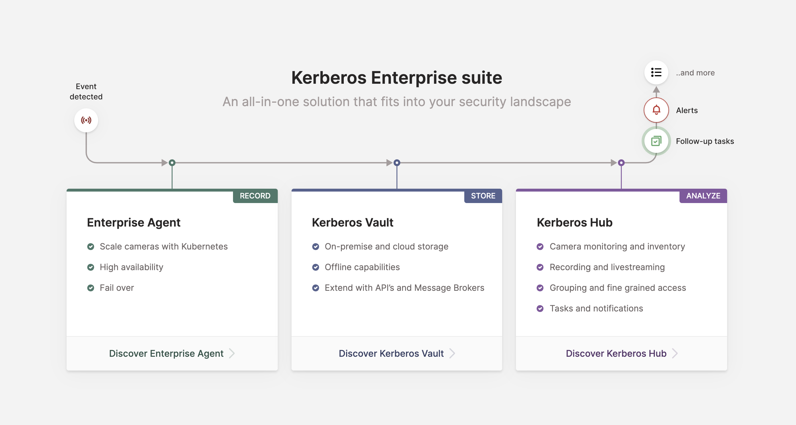

# Kerberos Vault

[Kerberos Agents](https://github.com/kerberos-io/agent) store recordings on the local disk. To centralise your data at a single place, additional solutions are available such as Kerberos Vault and Kerberos Hub. This repository covers the installation and configuration of Kerberos Vault. To have [a better understanding of Kerberos Vault](https://doc.kerberos.io/vault/first-things-first/) move to the documentation page of Kerberos Vault, which will give you an introduction and overview of the solution and its capabilities. However to avoid you switching too much between pages, we've [added a short introduction below](#introductions-1).

## :thinking: Prerequisites

* A VM with Docker installed, or a Kubernetes cluster configured with multiple nodes.
* Cloud or Edge object storage such as (Minio, Ceph, Google Cloud Storage, etc)

## :books: Overview

### Installation
1. [Docker](#docker)
2. [Kubernetes](#kubernetes)

### Examples
3. [Integrations and extensions](#integrations-and-extensions)
   
### Introductions
4. [Kerberos Vault](#kerberos-vault-1)
5. [Kerberos Hub](#kerberos-hub)
6. [Mission](#mission)
   
## Installation

For installing Kerberos Vault, we propose two different installation methods. Depending on your use case and purpose you might prefer one over the other.

### Docker

So you have home setup, or just want to try this out for a POC, then the `Docker` installation would be more suitable. This will safe you some time setting up a complete `Kubernetes` cluster.

> Follow the `Docker` tutorial [by navigating to the docker sub folder in this repostitory](docker/).

### Kubernetes

If you consider a production proof and ready environment, `Kubernetes` will provide you with the flexibility and resilience you are looking for. The setup especially when doing self-hosted requires a learning curve. If you feel comfortable with `Kubernetes` then this installation will not be too difficult.

> Follow the `Kubernetes` tutorial [by navigating to the kubernetes sub folder in this repostitory](kubernetes/).

## Integrations and extensions

A couple of [integrations and extensions can be found in the `examples` folder](examples). These examples illustrates how the Kerberos Vault API is working, and how it can be used to develop custom algorithms or applications.

## Introductions

Please note that we have added a brief introduction to Kerberos Vault and Kerberos Hub below. To get a complete overview [visit the documentation page](https://doc.kerberos.io), where you will be able to learn about all the ins and outs of the Kerberos.io ecosystem.

### Kerberos Vault
In addition to storing recordings in your [Kerberos Agents](https://github.com/kerberos-io/agent), you have the option to Bring Your Own Storage (BYOS), using [Kerberos Vault](https://doc.kerberos.io/vault/get-started/). Kerberos Vault allows you to configure the storage providers you want (where you data will be persisted), and allows you to connect to your [Kerberos Agents](https://github.com/kerberos-io/agent) and Kerberos Hub installation. These storage provider could live in the cloud such as AWS S3,GCP storage and Azure Blob store, or can be located on premise - at the edge - such as Minio or Ceph.

Despite the flexible storage capabilities, Kerberos Vault is also an open platform, which can be used to build extensions (mobile apps, web apps, machine learning services, etc) and integrations. It allows you to leverage a scalable and stable system as a strong backbone for your video analytics solutions, machine learning algorithms, and more.

### Kerberos Hub 

One or more [Kerberos Agents](https://github.com/kerberos-io/agent), can store their data directly in [Kerberos Hub SAAS service](https://doc.kerberos.io/hub/first-things-first/), and benefit from the visualisation layer Kerberos Hub offers. When doing this your recordings will be uploaded inside our internal Kerberos Vault (which is a black box for you). Alterantively you could bring your own Kerberos Vault, and connect it to our Kerberos Hub SAAS service, or even to your own Kerberos Hub private installation.

### Mission

Both Kerberos Hub and Kerberos Vault belong to the Enterprise suite. The goal of this suite is to support enterprises building a scalable video surveillance infrastructure that is open to support all business processes and usecases. Kerberos Enterprise Suite will do all the heavy lifting in terms scaling the processing and storage of you surveillance cameras. On top of that it will provide integration and extensibility to build your own applications on top of that using Swagger API's, and real-time messaging such as Kafka.

