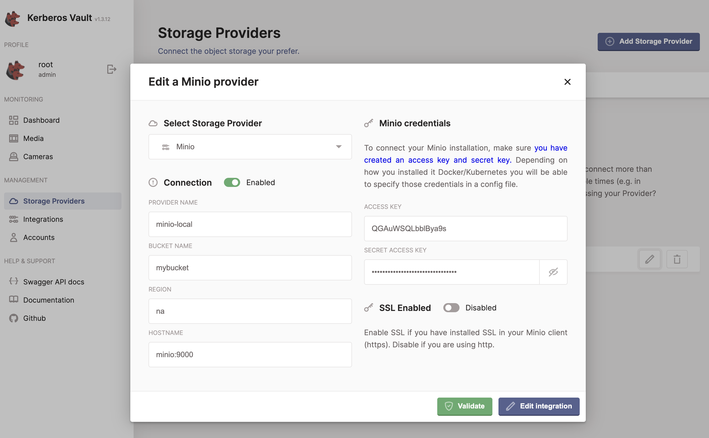
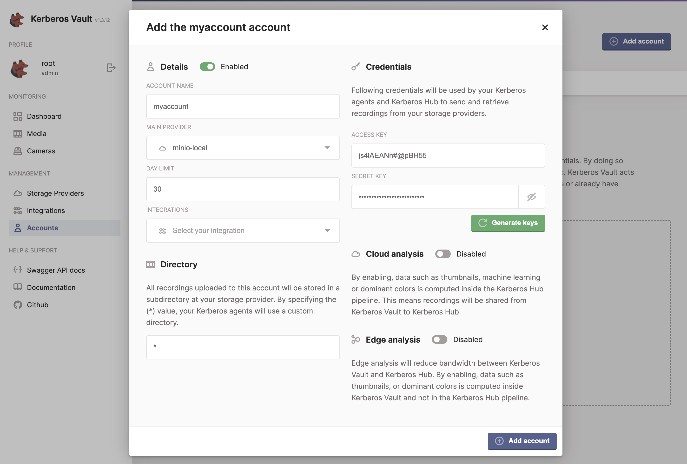

# Kerberos Vault in Docker

Kerberos Vault can also be installed without a Kubernetes cluster, by leveraging plain Docker containers or `docker compose`. In this example we'll show how to setup Kerberos Vault and it's required service MongoDB. We'll use a local Minio container, but you could leverage other local storage (Ceph) or cloud storage (Minio, Storj, Google Cloud Storage, S3).

There are still some tweaks and works to do (see below), to make this setup more secure and polished.

- [ ] Implement TLS binding with Traefik
- [ ] Move to Docker volume

## In this example we'll be using a clean VM

We've created an Ubuntu 20.04 (LTS) VM on DigitalOcean, and installed `docker` and `docker-compose` using the general installation. Follow [Docker installation here.](https://docs.docker.com/engine/install/ubuntu/)

## Setup networking

For this tutorial we will setup a new virtual network, which we'll name `cluster-net`.

    docker network create cluster-net

Verify if the network is successfully created.

    docker network ls

Make sure you'll locate the `cluster-net` network.

       NETWORK ID     NAME          DRIVER    SCOPE
       cf5e5c5ed641   bridge        bridge    local
    -> 75007810f24b   cluster-net   bridge    local
       4391b62e250d   host          host      local
       d5a219a216f5   none          null      local

## Create host volumes

To persist our date outside our containers, we'll make a few directories on our host machine, that we will bind to our containers.

    mkdir vault
    mkdir mongodb

## Run the workloads

Now we are ready to start the `docker compose` configuration. While creating we will create several services:

- Traefik: will be used an `Ingress` to reach our other services.
- Kerberos Vault: The application that stores recordings from Kerberos Agent in a storage provider; minio for this example.
- Minio: The local object storage we are setting up.
- MongoDB: Kerberos Vault will store some metadata in a MongoDB instance.

Create the services using the `create` command.

    docker compose create

One created you can activate the services with the `up` command.

    docker compose up

## Modify host files

Now add some records to your `/etc/hosts` file, so you can reach the Kerberos Vault instance (and API) and Minio console, through your predefined DNS name.

    178.xxx.xxx.41 kerberos-vault-api.domain.tld kerberos-vault.domain.tld minio-console.domain.tld 

# Let's configure it!

Now the services are up and running, you should be able to access both the Kerberos Vault application as the Minio console. You can access both applications using the credentials specified in the `environment` variables.

## Open Minio Console

Open your favourite browser, and open the Minio Console - `http://minio-console.domain.tld `. You should see the Minio console showing up; depending on your version this might look different.

Use the credentials you've defined for the Minio service. By default this is `ROOTNAME` and `CHANGEME123`. Please change that for your own configuration. Once signed in successfully, move over to the `Buckets` page by selecting the navigation item.

Once opened, select the `Create Bucket +` button to create a new bucket, propose a name of your preference. 

### (Optional) Create Access Keys

By default you'll be able to use your Minio username and password; as you used to sign into the console. However it's a better practice to create some Access keys (and secret key). Open the `Access Keys` page by selecting the navigation item, once opened press the `Create access key+` button. 

Some proposal keys are shown, modify or use as-is, copy them for your availability.

## Configure Kerberos Vault

Open a new tab in your browser and paste in the Kerberos Vault url `http://kerberos-vault.domain.tld`. The login page will show up, use the credentials you've defined for Kerberos Vault, by default this is `root` and `pass`; please modify this to your needs.

### Add a storage provider

To store your data, Kerberos Vault, leverages other storage solutions such as (MinIO, Storj, S3, Google Cloud Storage, Ceph, etc) to store your data. In that sense Kerberos Vault acts as a proxy between your Kerberos Agents and the persistence layer. By doing that Kerberos Vault decouples persistence from your Kerberos Agents, and allows you to switch persistence on-the-fly. Next to this there are many more advantages such as caching, forwarding, etc.

Open the `Storage Providers` page, by selecting the navigation item. Select the `+ Add Storage Provider` button, to create a new storage provider.

Select the option `Minio` from the dropdown and fill-in the required fields.

- Provider name: an unique name that matches your needs.
- Bucket name: the name of the bucket you created in Minio.
- Region: not required, use `na`; stands for notapplicable.
- Hostname: this should match the minio service name, for this configuration it would be `minio:9000`, as we run minio on port `9000`.
- Access key and Secret key: the keys you have created in the optional step, or the username and password you've provided to access the console.
- SSL enabled: keep this disabled, as we didn't implement it.

Press the `validate` button, you should see a green confirmation box at the top. If not you should verify in the logs what might be going wrong.

### Add an account

Now we have create a storage provider, we'll need to provide access to that provider by creatign an account. An account contains credentials that can be used by a Kerberos Agents in the storage provider, in other words an account protects a storage provider from the outside, and only allows operations on it by using the correct account credentials.

Open the account page, by selectig the `Accounts` navigation item. Select the `+ Add Account` button. Fill-in the required fields to create an account.

- Account name: an unique name that matches your needs.
- Main provider: select the provider we have created.
- Day limit: the life time of a recording; number of days it will be persisted.
- Integrations: a message broker that will be triggered on receival of a recording.
- Directory: set it `*`, this wildcard option allow you to leverage it for multiple users or sub directories.
- Access Key and Secret Key: Press the `Generate` button, to get some strong keys.
- Cloud analysis: Disabled, not necessary if you do not connect ot Kerberos Hub.
- Edge analysis: Disabled, not required.

## You're done!

Now you are ready setting up Kerberos Vault with Minio! It's time to connect some Kerberos Agents! Let's have a look here how to do that.