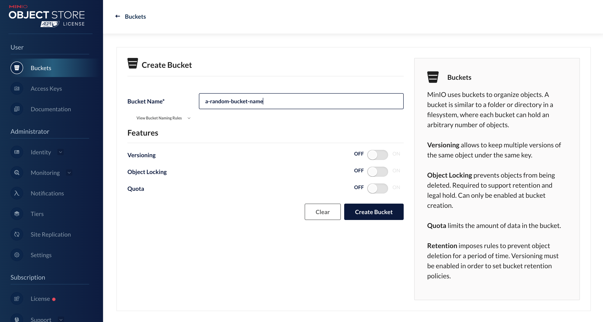

# Kerberos Vault in Docker

Kerberos Vault can also be installed without a Kubernetes cluster, by leveraging plain Docker containers or `docker compose`. In this example we'll show how to setup Kerberos Vault and it's required service MongoDB.

- [ ] Implement TLS binding with Traefik
- [ ] Move to Docker volume

## In this example we'll be using a clean VM

We've created an Ubuntu 20.04 (LTS) VM on DigitalOcean, and installed `docker` and `docker-compose` using the general installation.

[Follow Docker installation here](https://docs.docker.com/engine/install/ubuntu/)

## Setup networking

For this tutorial we will setup a new virtual network, which we'll name `cluster-net`.

    docker network create cluster-net

Verify if the network is successfully created.

    docker network ls

Make sure you'll locate the `cluster-net` network.

       NETWORK ID     NAME          DRIVER    SCOPE
       cf5e5c5ed641   bridge        bridge    local
    -> 75007810f24b   cluster-net   bridge    local
       4391b62e250d   host          host      local
       d5a219a216f5   none          null      local

## Create host volumes

To persist our date outside our containers, we'll make a few directories on our host machine, that we will bind to our containers.

    mkdir vault
    mkdir mongodb

## Run the workloads

Now we are ready to start the `docker compose` configuration. While creating we will create several services:

- Traefik: will be used an `Ingress` to reach our other services.
- Kerberos Vault: The application that stores recordings from Kerberos Agent in a storage provider; minio for this example.
- Minio: The local object storage we are setting up.
- MongoDB: Kerberos Vault will store some metadata in a MongoDB instance.

Create the services using the `create` command.

    docker compose create

One created you can activate the services with the `up` command.

    docker compose up

## Modify host files

Now add some records to your `/etc/hosts` file, so you can reach the Kerberos Vault instance (and API) and Minio console, through your predefined DNS name.

    178.xxx.xxx.41 kerberos-vault-api.domain.tld kerberos-vault.domain.tld minio-console.domain.tld 

## Let's configure it!

Now the services are up and running, you should be able to access both the Kerberos Vault application as the Minio console. You can access both applications using the credentials specified in the `environment` variables.

### Open Minio Console

Open your favourite browser, and open the Minio Console - `http://minio-console.domain.tld `. You should see the Minio console showing up; depending on your version this might look different.

Use the credentials you've defined for the Minio service. By default this is `ROOTNAME` and `CHANGEME123`. Please change that for your own configuration. Once signed in successfully, move over to the `Buckets` page by selecting the navigation item.

Once opened, select the `Create Bucket +` button to create a new bucket, propose a name of your preference. 

#### (Optional) Create Access Keys

By default you'll be able to use your Minio username and password; as you used to sign into the console. However it's a better practice to create some Access keys (and secret key). Open the `Access Keys` page by selecting the navigation item, once opened press the `Create access key+` button. 

Some proposal keys are shown, modify or use as-is, copy them for your availability.

### Configure Kerberos Vault

To be written