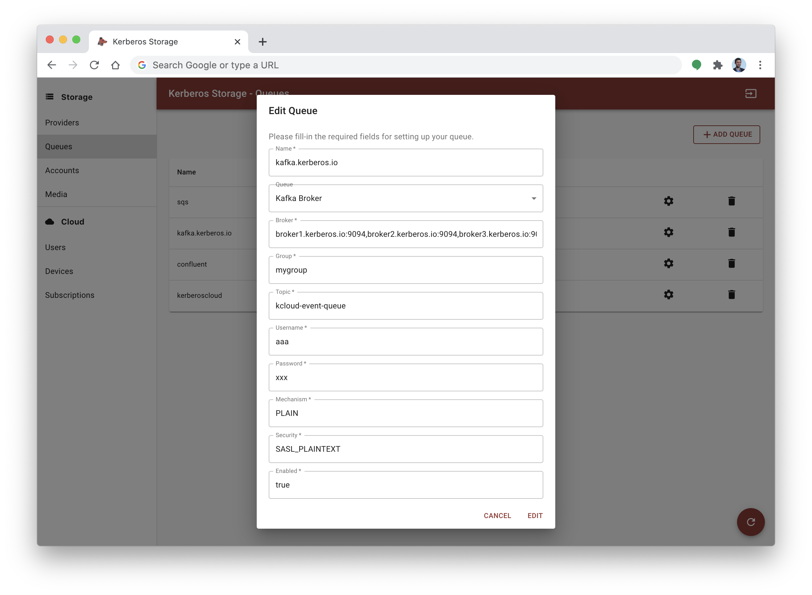
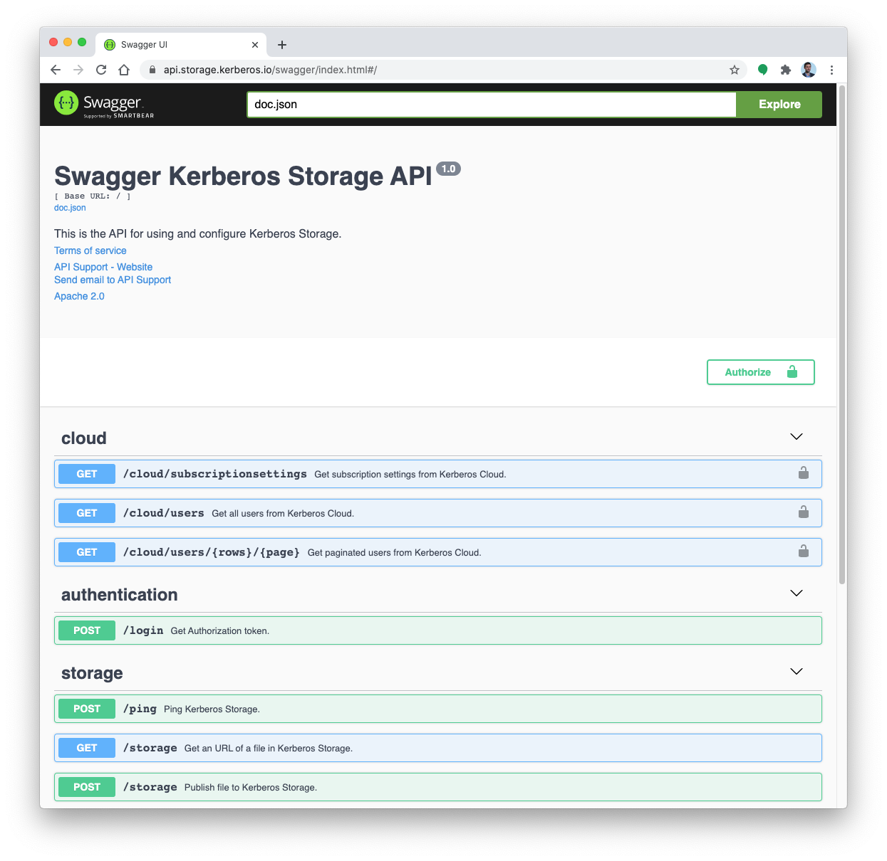
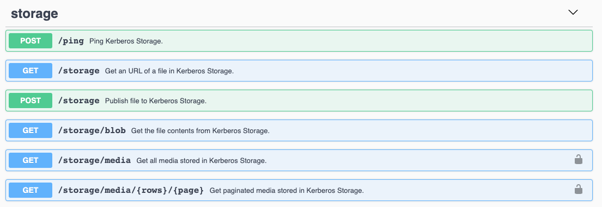
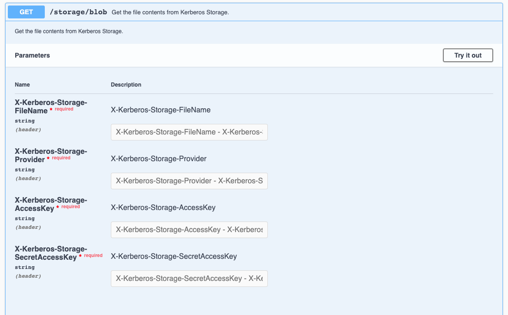

# Kerberos Vault - A Kafka handler

The purpose of this exercise will cover following steps:

1. Setup a Kafka broker,
2. Connect Kerberos Vault to Kafka,
3. Retrieve and process real-time messages,
4. Fetch related recording from Kerberos Vault API.
5. Execute a color histogram algorithm.

By doing this exercise you have to make sure you have a running kubernetes (k8s) cluster and properly setup [Kerberos Enterprise](https://doc.kerberos.io/enterprise/installation) and [Kerberos Vault](https://doc.kerberos.io/vault/installation).

After installation make sure you have connected on or more cameras to Kerberos Enterprise and have one or more providers (Azure, AWS, GCP or Minio) connected to Kerberos Vault.

Ok.. Let's go!

## 1. Setup a Kafka broker

Installing a Kafka broker is easy. At least it's easy for people who are familiar with Helm. Go ahead and install the Kafka helm chart using following command.

    helm repo add bitnami https://charts.bitnami.com/bitnami
    helm install --name kafka bitnami/kafka  -f ./kafka/values.yaml

The `kafka/values.yaml` file contains all the different configurations for your Kafka Broker: username and password, replication factory, number of workers etc. You might need to finetune this for your specific usecase.

Once properly installed you should be able to open a Kafka client (e.g. Kafka Tool), and add the different credentials (Bootstrap servers) and JAAS config.

    org.apache.kafka.common.security.plain.PlainLoginModule required username="aaa" password="xxx";

## 2. Connect Kerberos Vault to Kafka

Making the assumption you have successfully setup your Kafka broker, we can now update our Kerberos Vault installation. Open the Kerberos Vault web interface, and select the queue tab. Add a new queue, select Kafka and fill-in the different settings.

Once saved, all files being uploaded to the Kerberos Vault provider will trigger a message to be send to the Kafka broker and more specifically the topic you've defined (kcloud-event-queue, in above example).

## 3. Retrieve and process real-time messages with Python

A lot of different SDK's and libraries are available for interacting with Kafka brokers (C++, .NET, Golang, Python, PHP, etc). However for simplicity we will use Python.

First install the confluent_kafka Python library.

    pip3 install confluent_kafka

Add following code to a `index.py` file.

    from mqueue import CreateQueue

    kafkaQueue = CreateQueue(queueName='kerberos-storage-example-queue',
                             broker='broker1.kerberos.io:9094,broker2.kerberos.io:9094,broker3.kerberos.io:9094',
                             mechanism='PLAIN',
                             security='SASL_PLAINTEXT',
                             username= 'aaa',
                             password='xxx')
    while True:
        try:
            messages = kafkaQueue.ReceiveMessages()
            for message in messages:
                print message
                print("next..")
            print("reading..")

        except Exception as e:
            print("error..")
            print(e)
            pass

Add following code to a `mqueue.py` file.

    import json
    from confluent_kafka import Producer, Consumer

    def CreateQueue(queueName='', broker='', mechanism='', security='', username= '', password=''):
        return Kafka(queueName=queueName, broker=broker, mechanism=mechanism, security=security, username=username, password=password)

    class Kafka:
        def __init__(self, queueName='', broker='', mechanism='', security='', username= '', password=''):
            self.queueName = queueName
            kafkaC_settings = {
                'bootstrap.servers': broker,
                "group.id":             "mygroup",
                "session.timeout.ms":   10000,
                "queued.max.messages.kbytes": 10000, #10MB
            	"auto.offset.reset":    "earliest",
                "sasl.mechanisms":   mechanism,#"PLAIN",
                "security.protocol": security, #"SASL_PLAINTEXT",
                "sasl.username":     username,
                "sasl.password":     password,
            }
            self.kafka_consumer = Consumer(kafkaC_settings)
            self.kafka_consumer.subscribe([self.queueName])

        def ReceiveMessages(self):
            msg = self.kafka_consumer.poll(timeout=1.0)
            if msg is None:
                return []
            return [json.loads(msg.value())]

        def Close(self):
            self.kafka_consumer.close()
            return True

When running this code `python3 index.py`, it will continously read from the specified Kafka topic. Each time a recording is uploaded to Kerberos Vault, an event will be generated within a few milliseconds. For example:

    next..
    reading..
    {u'date': 1606164482, u'source': u'gcp-europe-west1', u'payload': {u'fileSize': 305956, u'key': u'vessosa/1606164482_6-818812_FundoEsquerda_229-153-288-247_51_745.mp4', u'metadata': {u'capture': u'IPCamera', u'uploadtime': u'1606164482', u'event-token': u'0', u'event-microseconds': u'0', u'event-numberofchanges': u'51', u'event-instancename': u'FundoEsquerda', u'event-timestamp': u'1606164482', u'publickey': u'AQER!@$214m2154125!TFsdgdsddb325@#%', u'event-regioncoordinates': u'229-153-288-247', u'productid': u'zdrPvi7pwxiWBWBpvvAI6il3fL'}}, u'events': [u'monitor', u'sequence', u'analysis', u'throttler', u'notification'], u'provider': u'kstorage'}
    next..
    reading..
    {u'date': 1606164579, u'source': u'gcp-europe-west1', u'payload': {u'fileSize': 2334417, u'key': u'cedricve/1606164579_6-427681_side_200-200-400-400_24_551.mp4', u'metadata': {u'uploadtime': u'1606164579', u'event-token': u'0', u'event-microseconds': u'0', u'event-numberofchanges': u'24', u'event-instancename': u'side', u'event-timestamp': u'1606164579', u'publickey': u'AQER!@$214m2154125!TFsdgdsddb325@#%', u'event-regioncoordinates': u'200-200-400-400', u'productid': u'qOjUUiPksm3cLqldChp2s6Y1e2LBmj'}}, u'events': [u'monitor', u'sequence', u'analysis', u'throttler', u'notification'], u'provider': u'kstorage'}
    next..
    reading..
    reading..

Each message contains the filename of the recording but also some metadata: timestamp, provider name (source), number of changes pixels (event-numberofchanges), etc.

## 4. Fetch related recording from Kerberos Vault API.

The next step in the exercise is to request the content (recording) from the Kerberos Vault API, so we can load it into memory and do some computer vision.

To do this we first have to retrieve the filename (key) from the message, and the Kerberos Vault provider (source) to which the file was uploaded.

    fileName = message['payload']['key']
    provider = message['source']

Once retrieved these data fields, we can build up the API call to the Kerberos Vault API. However before proceeding we could have a look at the Swagger API which ships with Kerberos Vault API.

Open your browser and go to `http(s)://api.yourkerberostoragedomain.com/swagger/index.html`. Following page should show up. The swagger page will show you all the available endpoints which you can use to interact with the Kerberos Vault API.

Scroll down until you see the storage section, and find the `/storage/blob` endpoint. This endpoint allows you to retrieve the binary file (recording) from your defined Kerberos Vault provider (AWS, GCP, Azure, or Minio).

When opening the `/storage/blob` endpoint, you will see all the required fields to be send to the API, to retrieve the file from Kerberos Vault. As you can see a couple of headers needs to be send to the API:

- X-Kerberos-Storage-FileName: this is the filename we retrieved from the Kafka message.
- X-Kerberos-Storage-Provider: the provider which was used to store the file on.
- X-Kerberos-Storage-AccessKey: the account AccessKey which you defined in the Kerberos Vault account section.
- X-Kerberos-Storage-SecretAccessKey: the account SecretAccessKey which you defined in the Kerberos Vault account section.

Before implementing the Python code, you could already verify with Swagger if you are using the write fields for requesting the file contents. A successful example might looks like this.

A failed request, with invalid credentials (keys), might look like this.

Now we know how to interact with the Kerberos Vault API, let's translate it to python code.

### Request library

To make a HTPP call, we can use the traditional Request library. First make sure you have it installed.

    pip3 install requests

Once installed we can import it into our `index.py` file.

    import requests

Within the message retrieval loop add the necessary HTTP Get request, with the appropriate headers, as defined previously in Swagger. If successfull you will receive the recording in the fileContent variable. Next we can store it into a mp4 container, by writing to the `fileContent` to a file.

    fileName = message['payload']['key']
    provider = message['source']

    response = requests.get(
      'http(s)://api.yourkerberostoragedomain.com/storage/blob',
      headers={
        'X-Kerberos-Storage-FileName': fileName,
        'X-Kerberos-Storage-Provider': provider,
        'X-Kerberos-Storage-AccessKey': 'xxx',
        'X-Kerberos-Storage-SecretAccessKey': 'xxx',
      },
    )

    if response.status_code != 200:
        print("Something went wrong: " + response.content)
        continue

    fileContent = response.content
    with open('video.mp4', 'wb') as file:
        file.write(fileContent)

If all went well, you should see messages being displayed and a video file being saved locally `video.mp4`.

## 5. Execute a color detection algorithm.

Now we have successfully retrieved the video from Kerberos Vault API, we can now process the video by a computer vision algorithm or function. Let's first install some dependencies.

    pip3 install opencv-python
    pip3 install sklearn

Let's go ahead and calculate the histogram of the video, using the `KMeans` function of `sklearn.cluster`. More info about the function [can be found here](https://scikit-learn.org/stable/modules/clustering.html#k-means). Before we can use the KMeans function, we first need to import `opencv`, open the video file and read a frame.

    import cv2

Create a video capture, pass in the filename `video.mp4` and  read the first frame.

    vidcap = cv2.VideoCapture('video.mp4')
    success,img = vidcap.read()

Now we can retrieve the individual frames, let's add following function to you `index.py` file. This function `calculateHistogram` will calculate a color histogram of the frame you've provided to the function.

    def calculateHistogram(img):

        img = cv2.cvtColor(img, cv2.COLOR_BGR2RGB)
        img = img.reshape((img.shape[0] * img.shape[1],3)) #represent as row*column,channel number
        clt = KMeans(n_clusters=3)
        clt.fit(img)

        numLabels = np.arange(0, len(np.unique(clt.labels_)) + 1)
        (hist, _) = np.histogram(clt.labels_, bins=numLabels)

        hist = hist.astype("float")
        hist /= hist.sum()

        rgbs = []
        for cluster in clt.cluster_centers_:
            rgbs.append(list(map(int,cluster)))
        return rgbs

Place the fuction `calculateHistogram` inside your for loop, and insert the `img` object. The `calculateHistogram` will return the top 3 most-common (RGB) colors found inside the first image of your video.

    vidcap = cv2.VideoCapture('video.mp4')
    success, img = vidcap.read()

    histogram = []
    if success:
        histogram = calculateHistogram(img)
    else:
        print("Something went wrong while capturing a frame from video.mp4")
    print(histogram)

Run the script and voila.

    python3 index.py

Should result in something like this.

    next..
    reading..
    {'events': ['monitor', 'sequence', 'analysis', 'throttler', 'notification'], 'provider': 'kstorage', 'source': 'gcp-europe-west1', 'payload': {'key': 'dietfig/1606211733_6-411390_Driveway_12-91-92-183_121_605.mp4', 'fileSize': 5072109, 'metadata': {'capture': 'IPCamera', 'event-token': '0', 'event-numberofchanges': '121', 'uploadtime': '1606211733', 'event-microseconds': '0', 'productid': 'x9GOtrqUEsEbLHMv88U5aAqPgu', 'event-instancename': 'Driveway', 'event-regioncoordinates': '12-91-92-183', 'event-timestamp': '1606211733', 'publickey': 'AQER!@$214m2154125!TFsdgdsddb325@#%'}}, 'date': 1606211733}
    [[46, 48, 45], [157, 159, 156], [100, 102, 99]]
    next..
    reading..
    {'events': ['monitor', 'sequence', 'analysis', 'throttler', 'notification'], 'provider': 'kstorage', 'source': 'gcp-europe-west1', 'payload': {'key': 'PraxisgemeinschaftVitality/1606212932_4-2705_empfang_264-26-488-166_98_614.mp4', 'fileSize': 158524, 'metadata': {'capture': 'IPCamera', 'event-token': '0', 'event-numberofchanges': '98', 'uploadtime': '1606212932', 'event-microseconds': '0', 'productid': 'LnhwWIRc6kt5U0mUXxKybzBktt', 'event-instancename': 'empfang', 'event-regioncoordinates': '264-26-488-166', 'event-timestamp': '1606212932', 'publickey': 'AQER!@$214m2154125!TFsdgdsddb325@#%'}}, 'date': 1606212932}
    [[83, 79, 81], [152, 153, 153], [24, 23, 26]]
    next..
    reading..
