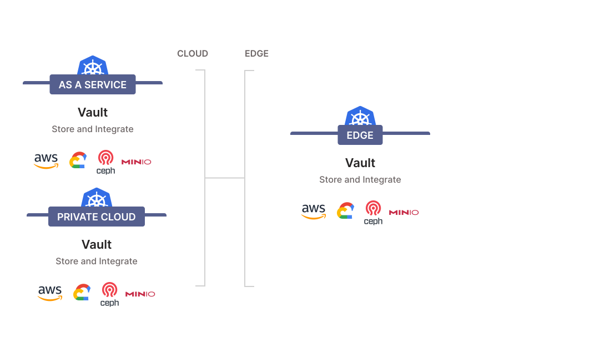

# Kerberos Vault on Kubernetes

As described in the `docker` installation, Kerberos Vault and it's required services are running inside containers. Due to the nature of `docker` and `docker-compose` it's straight forward to setup Kerberos Vault in a few minutes. Using `docker` will give you a good ramp-up speed, but will not provide you with a scalable and resilience deployment.

To overcome this and make Kerberos Vault scale, fault-tolerant and flexible, it's recommended to setup Kerberos Vault in a Kubernetes cluster.

## Managed Kubernetes vs Self-hosted Kubernetes

Just like `docker`, you bring your Kubernetes cluster where you want `edge` or `cloud`; private or public. Depending where you will host and how (e.g. managed Kubernetes cluster vs self-hosted) you'll have less/more responsibilities and/or control. Where and how is totally up to you, and your company preferences.

This installation guide will slight modify depending on if you are self-hosting or leveraging a managed Kubernetes service by a cloud provider. Within a self-hosted installation you'll be required to install specific Kubernetes resources yourself, such as persistent volumes, storage and a load balancer.

## Managed Kubernetes

To simplify the installation we will start with the most common setup, where you'll install Kerberos Vault on a managed Kubernetes services.

As of now there are many cloud providers such as, but not limited too, Azure, Google Cloud, AWS, and many more. Each cloud provider has build a management service on top of Kubernetes which takes over the heavy lifting of managing a cluster yourself. It makes specific resources such as built-in loadbalancers, storage, and more availble for your needs. The cloud provider manages all the complex things for you in the back-end and implements features such as 